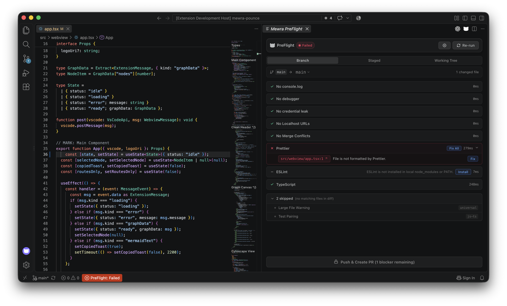
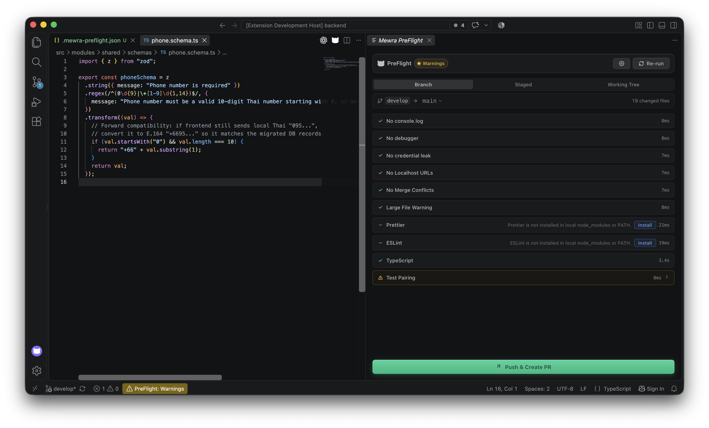
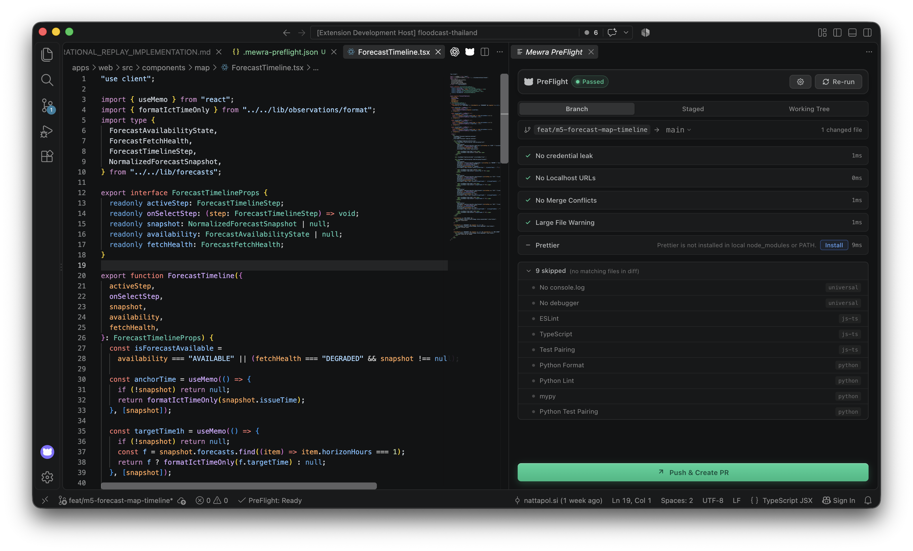
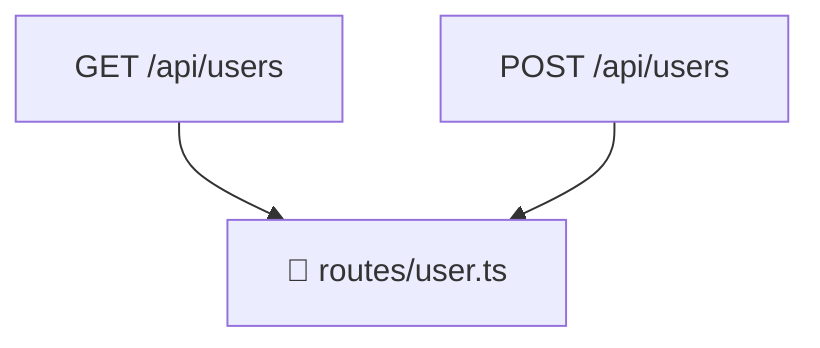

<p align="center">
  
</p>

# Mewra PreFlight — Pre-Push Sanity Pipeline

<p align="center">
  <a href="https://preflight.mewra.app"></a>
  <a href="https://github.com/mewra-lab/mewra-preflight"></a>
  <a href="https://github.com/mewra-lab/mewra-preflight/blob/main/LICENSE"></a>
</p>

> **Run diff-scoped checks before every push. One dashboard. One button to push and create your PR.**

Mewra PreFlight is an open-source VS Code extension that runs an in-editor pre-push sanity pipeline scoped to your git diff. It surfaces linter, formatter, type-checker, and sanity issues across your project in a live dashboard, and unlocks a one-click PR launch button once the pipeline is clean.

PreFlight acts as the **control tower** of the Mewra developer tooling ecosystem, orchestrating built-in polyglot checks, project-defined manual checklists, community JSON checks, and companion extensions like [Mewra Pounce](https://github.com/mewra-lab/mewra-pounce) (blast radius analysis).

Website: [preflight.mewra.app](https://preflight.mewra.app) · Part of the [Mewra](https://github.com/mewra-lab) developer tooling ecosystem.  
Source code: [github.com/mewra-lab/mewra-preflight](https://github.com/mewra-lab/mewra-preflight)

---

## Why

Pre-push hooks catch issues too late — they block the push in the terminal, force you out of your editor, and break your flow. Mewra PreFlight gives you real-time feedback inside VS Code before you even hit push.

```text
You hit Alt+Shift+P

PreFlight checks:  ✓ Prettier                 (12ms)
                   ✗ TypeScript               (412ms)
                     src/api.ts:88 — Argument is not assignable
                   ✗ No console.log           (4ms)
                     src/routes.ts:14 — Stray console.log() detected
                   ⚪ Golangci-lint            (not configured)
                   [ ] Apply DB migration to dev cluster (prisma/schema.prisma touched)

PR button → blocked until errors & required checklists are resolved.
```

---

## Features

- **Diff-scoped execution** — Analyzes only files modified in your git diff vs `main` (or your target branch), keeping checks instantaneous even on huge monorepos.
- **Polyglot ecosystem packs** — Built-in detection and runners for:
  - **JavaScript & TypeScript**: Prettier, ESLint, `tsc --noEmit`, test-file pairing.
  - **Python**: Ruff format, Black, Ruff check, Flake8, MyPy, test-file pairing.
  - **Go**: `gofmt`, `go vet`, `golangci-lint`, test-file pairing.
  - **PHP**: `php-cs-fixer`, `phpstan`, Psalm, test-file pairing.
- **Universal sanity checks** — Built-in guards detecting stray `console.log` / debuggers, exposed environment configurations, hardcoded localhost URLs, git merge conflict markers, and oversized binary files.
- **Mewra Pounce — Blast Radius** — The optional companion extension contributes diff-scoped route detection for changed Next.js, Hono, Express, Fastify, NestJS, Go, Python, and PHP files. It shows colour-coded route chips and adds Mermaid route summaries to the PR/MR draft.
- **Contributed security checks** _(v0.4.0)_ — Installed companion extensions register checks through the PreFlight API. Mewra Dependency Guard scans only changed lockfiles with OSV Scanner and Trivy, while preserving the insecure dependency-source guard.
- **Safe setup actions** _(v0.5.0)_ — A contributed check can mark itself as environment-managed, preventing PreFlight from incorrectly treating its check name as an npm package. Dependency Guard's scanner check instead reports its OSV/Trivy or Docker requirements.
- **`.preflightignore` support** _(v0.2.0)_ — Place a `.preflightignore` file in the workspace root to exclude files/folders from diff analysis globally (`dist/**`) or per-check/pack (`scripts/**: universal:no-console-log`, `legacy/**: js-ts`).
- **Interactive manual checklist** — Human verification checklist items that trigger conditionally when specific files are touched (e.g. verifying database migrations when schema files are modified).
- **Custom community JSON packs** — Easily define project-specific linters or script validations in `.mewra-preflight.json` without writing extension code.
- **AI coding agent MCP server** — Built-in Model Context Protocol (MCP) server exposing pipeline status, findings, and check execution to AI coding assistants and agent workflows.
- **One-click PR launcher** — Auto-assembles a rich pull request draft with commit summaries, test-pairing coverage, check results, and (when Pounce is enabled) an embedded Mermaid blast-radius diagram. After you push through your normal Git workflow, GitHub uses `gh` and GitLab uses `glab` to create the PR/MR with that description directly.
- **Graceful degradation (BYOT)** — Never bundles bulky toolchains. Uses your project's local versions (`node_modules`, `.venv`, `vendor`, global `PATH`). Missing tools show `not-configured` rather than failing.
- **Local-first & private** — No telemetry or background network activity. A Git push and direct GitHub PR creation occur only after you press the PR button.

---

## Visual Demo & Workflow

### 1. Instant Diff-Scoped Sanity Check (`Alt+Shift+P`)

Catch issues before git push. Findings link directly to the exact file and line, and provide one-click QuickFixes.

<p align="center">
  
</p>

- **Status Bar Integration**: Visual badge indicator (`PreFlight: Failed`) with real-time status.
- **In-Editor Findings**: Clickable file:line diagnostics (`src/webview/app.tsx:1 ↗`).
- **One-Click QuickFix**: Directly re-formats via Prettier (`Fix` / `Fix All`) without terminal commands.
- **Graceful Degradation**: Missing tools (e.g. ESLint not in `node_modules` or `PATH`) surface as neutral `not-configured` with a one-click `Install` button, never crashing or failing your build.
- **Gatekeeper Lock**: The **Create PR / MR** button is safely locked until blocking errors are resolved.

---

### 2. Non-Blocking Warnings & Review

Handle informational warnings and file-triggered human checklists without blocking urgent pushes.

<p align="center">
  
</p>

- **Target Branch Switching**: Seamlessly compare against `main`, `develop`, or custom release branches.
- **Scope Toggles**: Switch between `Branch` (all branch commits vs target), `Staged` (index only), or `Working Tree` (uncommitted edits).
- **Non-blocking Diagnostics**: Warnings (e.g. missing test pairing) are highlighted for review while keeping the PR button accessible.

---

### 3. Green Pipeline & One-Click PR Launch

All checks green. One click to push your branch and create your PR.

<p align="center">
  
</p>

- **All Clear Indicator**: Status bar and header show `✓ PreFlight: Ready` / `Passed`.
- **One-Click PR Launcher**: The emerald **↗ Create PR / MR** button never pushes. It creates a GitHub PR through an authenticated `gh` session or a GitLab MR through an authenticated `glab` session, including the generated description. If the CLI is unavailable or cannot authenticate, PreFlight opens the provider page and copies the description for paste.

For direct GitHub PR creation, install and authenticate the GitHub CLI once:

```bash
brew install gh # macOS
gh auth login
```

For a self-managed GitLab instance, install and authenticate GitLab CLI once:

```bash
brew install glab # macOS
glab auth login --hostname git.inet.co.th
```

---

## Install

### From GitHub Releases (.vsix)

1. Download `mewra-preflight-0.1.0.vsix` from [GitHub Releases](https://github.com/mewra-lab/mewra-preflight/releases/tag/v0.1.0).
2. Install via terminal:
   ```bash
   code --install-extension mewra-preflight-0.1.0.vsix
   ```
   Or in VS Code: Extensions view (`Ctrl+Shift+X` / `Cmd+Shift+X`) → `···` (Views and More Actions) → `Install from VSIX…`.

### From the VS Code Marketplace (Upcoming)

- **Quick Open**: Press `Ctrl+P` (or `Cmd+P` on macOS) and paste:
  ```text
  ext install mewra.mewra-preflight
  ```
- **Terminal CLI**:
  ```bash
  code --install-extension mewra.mewra-preflight
  ```
- **UI**: Search for `Mewra PreFlight` in the Extensions view (`Ctrl+Shift+X` / `Cmd+Shift+X`).

---

## Commands

| Command                         | Title                  | Default keybinding | Description                                              |
| :------------------------------ | :--------------------- | :----------------- | :------------------------------------------------------- |
| `mewra-preflight.runPipeline`   | Run PreFlight Pipeline | `Alt+Shift+P`      | Re-scans git diff and runs all enabled checks            |
| `mewra-preflight.openDashboard` | Open Dashboard         | —                  | Focuses or reveals the PreFlight Webview panel           |
| `mewra-preflight.launchPR`      | Create PR / MR         | Dashboard button   | Creates and opens its PR or MR after you push the branch |
| `mewra-preflight.openConfig`    | Open Configuration     | —                  | Opens `.mewra-preflight.json` in the active editor       |

---

## Settings

Configure via VS Code Settings (`settings.json`):

| Setting                             | Type       | Default                                                                              | Description                                                                 |
| :---------------------------------- | :--------- | :----------------------------------------------------------------------------------- | :-------------------------------------------------------------------------- |
| `mewraPreflight.targetBranch`       | `string`   | `"main"`                                                                             | Base branch to diff against                                                 |
| `mewraPreflight.diffScope`          | `string`   | `"branch"`                                                                           | Scope to analyze: `"branch"` (vs target branch), `"staged"`, or `"working"` |
| `mewraPreflight.enabledPacks`       | `string[]` | `["universal", "js-ts", "go", "python", "php", "orm-cost-sentry", "style-guardian"]` | Active built-in check packs                                                 |
| `mewraPreflight.blockingOnWarnings` | `boolean`  | `false`                                                                              | When true, warning-severity findings also block PR launch                   |
| `mewraPreflight.gitHost`            | `string`   | `"github"`                                                                           | Hosting platform for PR generation (`"github"` or `"gitlab"`)               |

---

## Check Packs & Tool Contracts

### 1. Universal Pack (Always active)

| Check                      | Severity  | What it detects                                                        |
| :------------------------- | :-------- | :--------------------------------------------------------------------- |
| **No debug statements**    | `error`   | `console.log`, `debugger`, `print()`, `var_dump()` in added diff lines |
| **No environment leaks**   | `error`   | Accidentally staged sensitive environment variables or keys            |
| **No hardcoded localhost** | `error`   | Added URLs matching `localhost` or `127.0.0.1`                         |
| **No merge conflicts**     | `error`   | Unresolved git conflict marker syntax in modified files                |
| **Large file warning**     | `warning` | Newly added files exceeding threshold (default 1 MB)                   |

### 2. Polyglot Language Packs

| Pack        | Tool            | Resolution order                    | Command / Behavior                                       |
| :---------- | :-------------- | :---------------------------------- | :------------------------------------------------------- |
| **JS / TS** | Prettier        | `node_modules/.bin/prettier` → PATH | `prettier --check <files>`                               |
|             | ESLint          | `node_modules/.bin/eslint` → PATH   | `eslint --format json <files>`                           |
|             | TypeScript      | `node_modules/.bin/tsc` → PATH      | `tsc --noEmit` (filtered to diff lines)                  |
|             | Test Pairing    | Built-in                            | Checks whether new source files have matching test files |
| **Python**  | Ruff / Black    | `.venv/bin` → `venv/bin` → PATH     | `ruff format --check <files>` or `black --check <files>` |
|             | Ruff / Flake8   | `.venv/bin` → `venv/bin` → PATH     | `ruff check <files>` or `flake8 <files>`                 |
|             | MyPy            | `.venv/bin` → `venv/bin` → PATH     | `mypy <files>`                                           |
|             | Test Pairing    | Built-in                            | Checks whether new modules have `test_<module>.py`       |
| **Go**      | gofmt           | GOROOT / PATH                       | `gofmt -l <files>`                                       |
|             | go vet          | GOROOT / PATH                       | `go vet ./...` (scoped to changed packages)              |
|             | golangci-lint   | PATH                                | `golangci-lint run <packages>`                           |
|             | Test Pairing    | Built-in                            | Checks whether new `*.go` files have `*_test.go`         |
| **PHP**     | php-cs-fixer    | `vendor/bin` → PATH                 | `php-cs-fixer fix --dry-run --diff <files>`              |
|             | phpstan / psalm | `vendor/bin` → PATH                 | `phpstan analyse <files>`                                |
|             | Test Pairing    | Built-in                            | Checks whether new classes have `*Test.php`              |

---

## Configuration (`.mewra-preflight.json`)

Mewra PreFlight is **Zero-Config by default** — it automatically detects your project's ecosystem and applies diff checks without requiring any configuration.

If you wish to customize checks, define manual checklist items, or add custom tools:

- Click the **⚙️ Settings icon** in the PreFlight Dashboard header (or run `Mewra PreFlight: Open Configuration` via the Command Palette) — this automatically generates a tailored `.mewra-preflight.json` starter file based on your project's detected ecosystems.
- Or copy and edit [`.mewra-preflight.json.example`](./.mewra-preflight.json.example):

```jsonc
{
  "$schema": "./schemas/preflight.schema.json",
  "targetBranch": "main",
  "ecosystems": {
    "js-ts": { "enabled": true },
    "python": { "enabled": true },
    "go": { "enabled": true },
    "php": { "enabled": false },
  },
  "universalChecks": {
    "noDebugStatements": "error",
    "noSecrets": "error",
    "noLocalhostUrls": "error",
    "largeFileThresholdMb": 1,
  },
  "customChecks": [
    {
      "id": "custom:shellcheck",
      "label": "ShellCheck",
      "tool": "shellcheck",
      "args": ["-x"],
      "severity": "warning",
      "fileExtensions": [".sh"],
    },
  ],
  "manualChecklist": [
    {
      "id": "manual-migration",
      "label": "Applied DB migration to dev cluster",
      "condition": { "modifiedFilesMatch": "prisma/migrations/**" },
      "agentCheckable": true,
    },
  ],
}
```

---

## Model Context Protocol (MCP) Integration

Mewra PreFlight provides built-in Model Context Protocol (MCP) support for workspace diagnostics and agent automation:

- **`get_preflight_status`** — Retrieves the live pipeline snapshot (checks, statuses, blockers).
- **`get_check_findings`** — Retrieves line-level findings for a specific check.
- **`run_check`** — Runs a specific registered check to verify code fixes.
- **`mark_manual_check`** — Toggles an `agentCheckable` checklist item upon verified criteria.

VS Code discovers this server through its MCP tools picker after the extension starts. Run the PreFlight dashboard once before asking an agent to re-run a check or update a checklist item, so it has a current diff-scoped snapshot. MCP is enabled by default; use the workspace config to restrict it:

```json
{
  "mcp": {
    "enabled": true,
    "exposedTools": ["get_preflight_status", "get_check_findings", "run_check"],
    "agentCheckableManualChecks": ["manual-migration"]
  }
}
```

An agent can modify a manual item only when it is named in `agentCheckableManualChecks` and the checklist item itself has `"agentCheckable": true`. The server is a VS Code-managed loopback endpoint with an ephemeral bearer token; it is not exposed to the network.

---

## The Mewra Tooling Ecosystem

Mewra PreFlight is designed as the orchestration host for the Mewra suite:

```text
┌──────────────────────────────────────────────────────────┐
│                     MEWRA PREFLIGHT                      │
│                    (Sanity Pipeline)                     │
└────────────┬─────────────┬─────────────┬─────────────┬───┘
             │             │             │             │
      ┌──────▼──────┐ ┌────▼───────┐ ┌───▼────────┐ ┌──▼───────────┐
      │mewra-pounce │ │ Dependency │ │  ORM Cost  │ │Style Guardian │
      │Blast Radius │ │   Guard    │ │   Sentry   │ │AST Conventions│
      └─────────────┘ └────────────┘ └────────────┘ └───────────────┘
```

- **[Mewra Pounce](https://github.com/mewra-lab/mewra-pounce)** (`mewra.mewra-pounce`): Traces reverse call hierarchy and surfaces blast radius directly in the PreFlight dashboard (affected public API routes, background workers, and jobs).
- **Mewra Dependency Guard** (`mewra.mewra-dependency-guard-vscode`): Registers a lockfile-only OSV and Trivy security scan plus the insecure dependency-source guard with PreFlight. Its check IDs remain `mewra-dependency-guard:security-scan` and `dependency-guard:unsafe-source`.
- **ORM Cost Sentry**: Detects N+1 query patterns and unindexed migration risks across Prisma, Drizzle, and SQLAlchemy.
- **Mewra Style Guardian**: Enforces AST design tokens and catches Tailwind CSS conflicts.
- **Mewra Drift**: Detects contract drift between API implementations and schemas.

---

## Roadmap

| Version   | Status      | Scope                                                                                                                                                                                                                                                                                                                               |
| :-------- | :---------- | :---------------------------------------------------------------------------------------------------------------------------------------------------------------------------------------------------------------------------------------------------------------------------------------------------------------------------------- |
| **0.1.0** | Released    | Core diff-scoped runner (branch, staged, working tree), Universal pack (secrets, console.log, debuggers, localhost, conflicts, file size), Polyglot packs (JS/TS, Python, Go, PHP), Community JSON custom packs, interactive manual checklist with file triggers, monorepo resolution, Built-in Model Context Protocol (MCP) server |
| **0.2.0** | Released    | Pounce route detection with dashboard/PR Mermaid summaries, per-folder check-pack overrides (`.preflightignore`)                                                                                                                                                                                                                    |
| **0.3.0** | Released    | First-party local, diff-scoped packs: Dependency Guard (insecure dependency sources), ORM Cost Sentry (query-in-loop and destructive migration heuristics), and Style Guardian (static Tailwind utility conflicts).                                                                                                                 |
| **0.4.0** | Released    | Versioned contributed-check API, workspace enablement/severity controls, and Mewra Dependency Guard as a separate OSV/Trivy companion extension that retains secure dependency-source checking.                                                                                                                                     |
| **0.5.0** | **Current** | Creates GitHub PRs through authenticated `gh` and GitLab MRs through authenticated `glab`, without pushing the branch; provider-page fallback copies the generated description for paste.                                                                                                                                           |
| **1.0.0** | Future      | **Mewra Drift integration** (API contract drift detection), automated git pre-push hook installer, production-stable release across VS Code Marketplace & Open VSX                                                                                                                                                                  |

---

## Developing

See [CONTRIBUTING.md](./CONTRIBUTING.md) for full development guidelines.

```bash
git clone https://github.com/mewra-lab/mewra-preflight.git
cd mewra-preflight
pnpm install
pnpm build
```

Press `F5` in VS Code to launch the Extension Development Host. To test the
sibling Mewra Dependency Guard source at the same time, select **Run PreFlight

- Dependency Guard (Extension Development Host)** from Run and Debug. This
  builds and loads both development extensions rather than mixing PreFlight
  source with an installed Dependency Guard VSIX.

**Quality gate:**

```bash
pnpm validate
```

Runs: formatting check → TypeScript compilation check → unit test suite → production build.

---

## Documentation

- [`SPEC.md`](./SPEC.md) — Full product and technical specification
- [`docs/ARCHITECTURE.md`](./docs/ARCHITECTURE.md) — Architecture, data flow, and trust boundaries
- [`docs/GIT-WORKFLOW.md`](./docs/GIT-WORKFLOW.md) — Git, branch, Conventional Commits & PR workflow
- [`docs/UX.md`](./docs/UX.md) — Webview UX, interaction patterns, and design tokens
- [`docs/TESTING.md`](./docs/TESTING.md) — Unit and extension testing strategy
- [`docs/RELEASE.md`](./docs/RELEASE.md) — Release and packaging guidelines
- [`CONTRIBUTING.md`](./CONTRIBUTING.md) — Contributing guide and PR rules
- [`SECURITY.md`](./SECURITY.md) — Security policy and threat model
- [`PRIVACY.md`](./PRIVACY.md) — Local-first privacy statement

---

## What's New in v0.4.0

**Contributed Dependency Guard**

- **Versioned extension API**: contributed checks now register against API version 1.
- **Workspace controls**: `.mewra-preflight.json` now applies `contributedChecks.<id>.enabled` and `.severity` to registered checks, including MCP-triggered runs.
- **Dependency Guard companion**: OSV and Trivy vulnerability scanning, plus the existing insecure dependency-source guard, now live in Mewra Dependency Guard, preserving PreFlight as the generic host.

## What's New in v0.3.0

**First-party local safety packs**

- **Dependency Guard** (`dependency-guard:unsafe-source`) fails a newly added `http://` or `git+http://` dependency source in supported manifest and lock files.
- **ORM Cost Sentry** flags likely database queries added inside loops and destructive `DROP` migration statements for review.
- **Style Guardian** flags conflicting static Tailwind utilities in changed JSX, Vue, HTML, Astro, and Svelte templates.

Each rule is enabled by default and can be disabled per workspace through the corresponding entry in `ecosystems` inside `.mewra-preflight.json`.

## What's New in v0.2.0

**Mewra Pounce Route Summary & `.preflightignore`**

### Route Summary (Mewra Pounce companion)

Install [Mewra Pounce](https://github.com/mewra-lab/mewra-pounce) to contribute `pounce:blast-radius`. The companion scans changed supported route files for route declarations; PreFlight renders its route chips and includes Mermaid route/file summaries in the PR/MR draft. Control it per workspace with `contributedChecks.pounce:blast-radius`.

The dashboard surfaces colour-coded HTTP method/path chips (`GET /api/users`, `POST /api/checkout`, …) and the PR draft launcher auto-attaches dedicated per-route Mermaid summaries.

````markdown
## 🗺️ Blast Radius — Impacted Entry Points

<details open>
<summary><code>GET /api/users</code> — routes/user.ts:3</summary>



</details>
````

Supported frameworks: **Next.js** App Router route handlers, **Express/Fastify** `router.get/post/…`, **Go** `net/http`, **mux**, **gin**, **Python** Flask/FastAPI/Django decorators, **PHP** Laravel/Symfony routing.

### `.preflightignore`

Create a `.preflightignore` file in your workspace root to exclude files from diff analysis:

```gitignore
# Completely ignore these paths
dist/**
fixtures/**
*.generated.ts

# Ignore specific checks or packs for a path
scripts/**: universal:no-console-log
legacy/**: js-ts
vendor/**: *
```

---

## Contributing

Contributions are welcome. Please read [CONTRIBUTING.md](./CONTRIBUTING.md) and [docs/GIT-WORKFLOW.md](./docs/GIT-WORKFLOW.md) before submitting a Pull Request.

## Security

Please report security issues privately. See [SECURITY.md](./SECURITY.md).

## Privacy

Mewra PreFlight is local-first and has no telemetry. See [PRIVACY.md](./PRIVACY.md).

## License

[MIT](./LICENSE) — Copyright (c) Mewra Lab.
Part of the [Mewra](https://github.com/mewra-lab) open-source developer tooling ecosystem.
